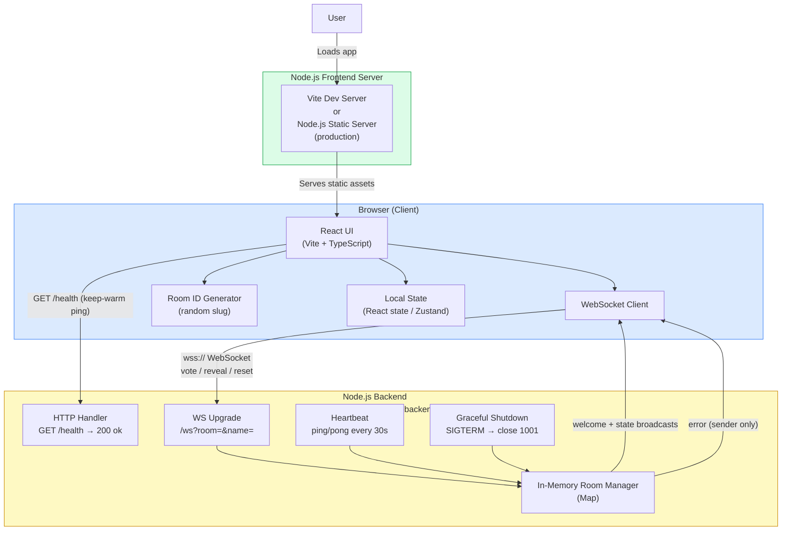
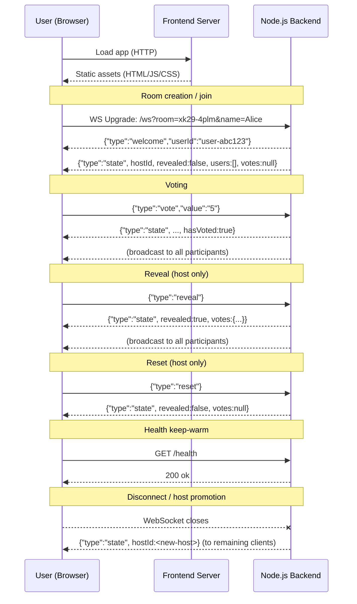

# Architecture Decisions

## System Architecture Overview

---

## Communication Flow

---

## Architecture Decision Records

### ADR-001 — Node.js for both frontend toolchain and backend runtime

**Status:** Accepted

**Context:** The product is a real-time, browser-based tool with no persistence. A consistent runtime reduces cognitive overhead and allows shared tooling (ESM, TypeScript, same package ecosystem).

**Decision:** Use Node.js throughout:
- **Backend:** single Node.js process using the `ws` package for WebSocket handling; all room state held in memory.
- **Frontend:** React SPA built and served via Vite (Node.js dev server); production bundle served as static files from a Node.js server (e.g., `serve` or a lightweight Express app).

**Consequences:** Straightforward deployment; no multi-language overhead. Single-process backend means no horizontal scaling without a pub/sub layer (acceptable given the ephemeral, small-room constraint).

---

### ADR-002 — WebSocket for all real-time communication

**Status:** Accepted

**Context:** Planning poker requires instant, simultaneous state updates to all participants (vote cast, reveal, reset, join/leave). Polling would introduce unacceptable latency and overhead.

**Decision:** Use a single persistent WebSocket connection per client (`wss://<host>/ws?room=<id>&name=<name>`). All game events (vote, reveal, reset) are client → server messages. All state updates are full-snapshot `state` broadcasts from server → all clients.

**Consequences:**
- No partial updates — every state change sends the full room snapshot, keeping client reconciliation trivial.
- No reconnect/resume: a disconnected client rejoins as a new user. Reconnect logic on the client mirrors initial join logic.

---

### ADR-003 — Room IDs generated client-side

**Status:** Accepted

**Context:** The backend creates rooms implicitly on first connection. There is no room-creation HTTP endpoint.

**Decision:** The frontend generates a random slug (e.g. `xk29-4plm`) matching `^[a-z0-9]{4,32}(-[a-z0-9]{4,32})*$` and embeds it in the URL. Sharing the URL is the join mechanism.

**Consequences:** No round-trip required to create a room. The room ID doubles as the join code — it must be unguessable but is not a secret. Collisions are astronomically unlikely with sufficient entropy.

---

### ADR-004 — No authentication or persistence

**Status:** Accepted

**Context:** The product requirements explicitly specify ephemeral sessions with no accounts.

**Decision:** No auth layer. No database. All state lives in the backend process's memory. Rooms are discarded when the last participant disconnects.

**Consequences:** Zero onboarding friction. A server restart wipes all active rooms; the product requirement accepts this. Room IDs should not be relied upon across sessions.

---

### ADR-005 — Host promotion via monotonic sequence number

**Status:** Accepted

**Context:** When the host disconnects the session must continue without interruption.

**Decision:** The backend assigns each connection a per-room monotonic `seq` (1, 2, 3, …). On host disconnect, the remaining participant with the smallest `seq` is automatically promoted. The updated `hostId` rides the same `state` broadcast as the disconnection.

**Consequences:** Deterministic, tie-free promotion. The client only needs to compare `state.hostId` to its stored `userId` to know if it is host — no special host-election protocol needed on the frontend.

---

### ADR-006 — Health endpoint for keep-warm pings

**Status:** Accepted

**Context:** The backend is hosted on Render's free tier, which spins down idle instances. A cold start during a workshop would be disruptive.

**Decision:** The frontend periodically calls `GET /health` (returns `200 ok`) to prevent the host from going idle. This is the only HTTP route; all game logic runs over WebSocket.

**Consequences:** Minimal — a single lightweight fetch on an interval. The route is stateless and imposes negligible backend load.

